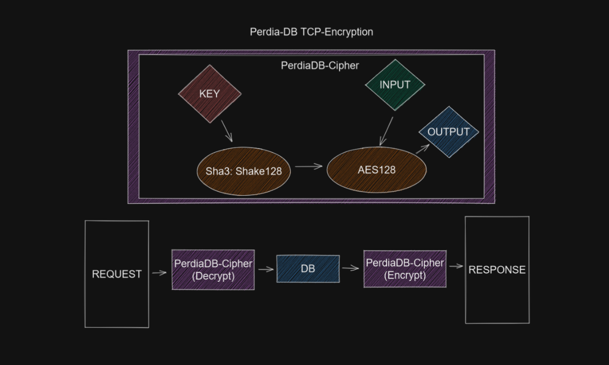

# Perdia-DB
A simple key value database for storing simple structures.
No nesting of structures is supported, but may be implemented in the future.

## Encryption


## Environment Variables

|Name|Description|
|-|-|
|PORT|Port on which the db-server will host it's service.|
|AES_KEY|Key used for traffic encryption using AES-128.|
|DIR|Disk-save directory path.|
|SAVE_FREQ|Disk-save interval in seconds.|

## Tokens

|Name|Description|
|-|-|
|QUERY|Used to get an Object by it's name.|
|CREATE|Create an object from a template.|
|GET|Get a value from an object with a key.|
|SET|Overwrite a value from an object using a key.|
|VALUE|Defines the value for the PUT command.|
|TYPE|Defines field type of a template or defines a new template.|
|NAME|Declare field name.|
|STARTING|Declares the value of a field if nothing is set.|
|END|Marks the end of template definition.|
|DELETE|Used to delete instances and templates.|

## Responses

The DB responds with the requested instances or templates with their specified fields.


## Example

### Declare Templates

Declaration of templates should only occur in their own request. Although everything works fine when it is not.
```
TEMPLATE "DAY";
STRING "First" VALUE "Nothing";
STRING "Second" VALUE "Nothing";
STRING "Third" VALUE "Nothing";
INTEGER "Day" VALUE 1;
FLOAT "Seconds" VALUE 0.0;
END "DAY";
```

### Create Objects

Make an instance of a defined template with a key.
```
CREATE "Monday" TEMPLATE "DAY";
```

Make an exact copy of an already existing instance.
```
CREATE "Tuesday" INSTANCE "Monday";
```

### Query Objects

Set fields.
```
SELECT "Monday"; 
SET "First" VALUE "Science";
SET "Second" VALUE "CS";
END "Monday";
```

Query templates
```
QUERY "DAY" FROM TEMPLATE;
```

Query instances
```
QUERY "Monday" FROM INSTANCE;
```

Query all templates
```
QUERY TEMPLATE;
```

### Delete Objects

This will only the delete the given instance.
```
DELETE "Monday" FROM INSTANCE;
```

This will delete all instances with the template and the template itself.
```
DELETE "DAY" FROM TEMPLATE;
```